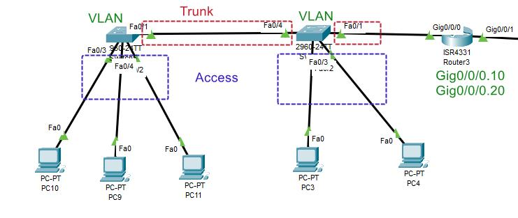
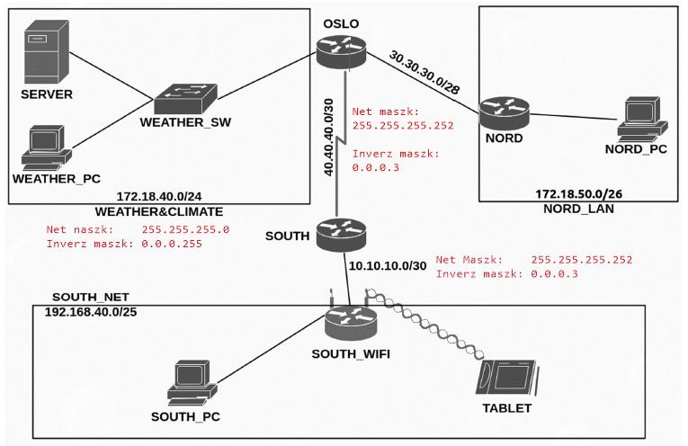

# Oktatás 2022

## Feladatok

- [Oktatas.hu > KöznevelésÉrettségi > Központi írásbeli feladatsorok, javítási útmutatók](https://www.oktatas.hu/kozneveles/erettsegi/feladatsorok):  
  `informatikai ismeretek`

## Cisco Packet Tracer

- Download: [Cisco Skills For All](https://skillsforall.com/resources/lab-downloads)

## Alap parancsok

```bash
# Belépés privilegizált módba
enable
# Belépés konfigurációs módba
configure terminal
# Kilépés egy szinttel feljebb
exit
# Help menü
?

# Hosztnév beállítása
ROUTER(config)> hostname Akarmi

# Futó konfiguráció megjelenítése a konzolon
ROUTER> show running-config
# Futó konfiguráció másolása az indítási konfigurációba
ROUTER> copy running-config startup-config
ROUTER> write memory

# Eszköz újraindítása
ROUTER> reload
```

## Felhasználókezelés

```bash
# Jelszó beállítása privilegizált módhoz
ROUTER(config)> enable password jelszo
ROUTER(config)> enable secret titkos-jelszo

# Felhasználó létrehozása
ROUTER(config)> username admin password admin
ROUTER(config)> username kutato password sark123
```

## Telnet

```bash
# Virtuális vonalak kiválasztása:
ROUTER(config)> line vty 0 15

# Belépés engedélyezése csak jelszóval
ROUTER(config-line)> password jelszó
ROUTER(config-line)> login

# Belépés engedélyezése helyi felhasználónak (pl. kutato)
ROUTER(config-line)> login local
```

```bash
# Futó konfiguráció mentése fájlba egy másik szerverre
ROUTER> copy running-config tftp
  Address or name of remote host []? 10.0.20.1
  Destination filename [SZOLGALTATO-confg]? szolgaltato.conf
```

## IP konfiguráció switch-en

```bash
# Virtuális hálózat kiválasztása
SWITCH(config)> interface Vlan 1
# IP cím és hálózati maszk megadása
SWITCH(config-if)> ip address 172.18.40.253 255.255.255.0
SWITCH(config-if)> exit
# Alapértelmezett átjáró beállítása
SWITCH(config)> ip default-gateway 172.18.40.254
```

## IP konfiguráció router-en

```bash
# Interface kiválasztása
ROUTER(config)> interface GigabitEthernet 0/0
# IP cím és hálózati maszk megadása
ROUTER(config)> ip address 20.255.255.254 255.0.0.0
ROUTER(config-if)> exit
# Alapértelmezett átjáró beállítása
ROUTER(config)> ip default-gateway 20.255.255.254
```

## DHCP konfiguráció

[youtube](https://www.youtube.com/watch?v=q29_iMZaRDA)

```bash
# Az első és utolsó öt IP cím kizárása a DHCP tartományból
ROUTER(config)> ip dhcp excluded-address 20.0.0.1 20.0.0.5
ROUTER(config)> ip dhcp excluded-address 20.255.255.250 20.255.255.254

# DHCP pool létrehozása 'OFFICE' névan
ROUTER(config)> ip dhcp pool OFFICE
# Hálózati cím és hálózati maszk megadása
ROUTER(dhcp-config)> network 20.0.0.0 255.0.0.0
# Alapértelmezett átjáró megadása
ROUTER(dhcp-config)> default-router 20.255.255.254
# DNS szerver beállítása
ROUTER(dhcp-config)> dns-server 11.11.11.11
```

## VLAN



```
Router:
- interface on
- create sub-interfaces
	interface GigabitEthernet0/1.27
	encapsulation dot1Q 27
	ip address 192.168.45.1 255.255.255....
	---
	interface GigabitEthernet0/1.42
	encapsulation dot1Q 42
	ip address 192.168.45.129 255.255.255....
- Crete DHCP pools:
    ip dhcp pool CETUS
	network 192.168.45.0 255.255.255....
	default-router 192.168.45.1
	dns ...
	---
    ip dhcp pool HYDRA
	network 192.168.45.128 255.255.255....
	default-router 192.168.45.129
	dns ...

Switch:
- Create VLAN database
	Switch(config)#vlan 23
	Switch(config-vlan)#name PC
- Create interface config
	Switch(config-vlan)#int Fa0/8
	Switch(config-if)#switchport mode access
	Switch(config-if)#switchport access vlan 23
- Create trunk:
    S1 -> S2
	S1 -> SW
	S2 -> S1
```

## Static NAT


```bash
Router(config)# ip nat inside source static 172.20.40.22 65.54.23.3

Router(config)# interface GigabitEthernet 0/0/0
Router(config-if)# ip nat inside 
Router(config-if)# exit

Router(config)# interface GigabitEthernet 0/0/1
Router(config-if)# ip nat outside 
Router(config-if)# exit
```

```bash
ip nat inside source static 172.18.40.250 30.30.30.14 
ip classless
ip route 0.0.0.0 0.0.0.0 GigabitEthernet 0/1
ip flow-export version 9
```

## OSPF

A `SOUTH_NET` és `WEATHER&CLIMATE` hálózatok hirdetése OSPF-el.  
A `NORD_LAN` nincs hirdetve! (Ha az is kellene, akkor hozzá kell adni a `network 30.30.30.0 0.0.0.15 area 0` parancsot is az OSLO router-hez.)



```bash
# OSPF konfigurálása 1911-es folyamatazonosítóval
OSLO(config)> router ospf 1911
OSLO(config-router)> log-adjacency-changes
# OSLO router-hez csatlakozó hálózatok (kivéve NORD_LAN)
OSLO(config-router)> network 40.40.40.0 0.0.0.3 area 0
OSLO(config-router)> network 172.18.40.0 0.0.0.255 area 0
```

```bash
# OSPF konfigurálása 1911-es folyamatazonosítóval
SOUTH(config)> router ospf 1911
SOUTH(config-router)> log-adjacency-changes
# SOUTH router-hez csatlakozó hálózatok
SOUTH(config-router)> network 10.10.10.0 0.0.0.3 area 0
SOUTH(config-router)> network 40.40.40.0 0.0.0.3 area 0
```

```bash
# Routing információk lekérdezése ellenőrzéshez
# (Az "O" jelzést kell keresni)
OSLO> route
SOUTH> route
```

## ACL (Accesc Control List)

Hozzáférési lista megadása

```bash
# Első ACL lista:
# 172.20.40.0 hálózat tiltása, kivéve 172.20.40.12
Router(config)> access-list 1 permit 172.20.40.12
Router(config)> access-list 1 deny 172.20.40.0 255.255.255.0

# Második ACL lista:
Router(config)> access-list 2 deny 192.168.1.0 255.255.255.0
```

## Hálózatik címek

[youtube](https://www.youtube.com/watch?v=s_Ntt6eTn94)

|  | /30 | /29 | /28 | /27 | /26 | /25 | /24 |
| --- | --- | --- | --- | --- | --- | --- | --- |
| Összes IP | 4 | 8 | 16 | 32 | 64 | 128 | 254 |
| Kiosztható | 2 | 6 | 14 | 30 | 62 | 126 | 252 |
| Maszk | 252 | 248 | 240 | 224 | 192 | 128 | 0 |

> 192.168.10.128/25
```bash
Network address:   `192.168.30.32`
NetMask(02):       `11111111.11111111.11111111.10000000`
NetMask(10):       `255.255.255.128`
Broadcast:
  0111111 = 127
  128 + 127 = 255
  192.168.10.255
IP Range:  129-254
```

> 192.168.30.32/27

```bash
Network address:   `192.168.30.32`
Net mask binary:   `11111111.11111111.11111111.11100000`
                   `                              11111` => 31
Net mask decimal:  `255.255.255.224`
Broadcast address: `192.168.30.63`
IP range:          `33-62`
```

> 192.168.50.8/29

```bash
Network address:   `192.168.50.8`
Net mask binary:   `11111111.11111111.11111111.11111000`
                   `                                111` => 7
Net mask decimal:  `255.255.255.248`
Broadcast address: `192.168.50.15`
IP range:          `9-14`
```

> 3.3.3.2/28

```bash
Network address:   `3.3.3.2`
Net mask binary:   `11111111.11111111.11111111.11110000`
                   `                               1111` => 15
Net mask decimal:  `255.255.255.240`
Broadcast address: `3.3.3.17`
IP range:          `3-16`
```
