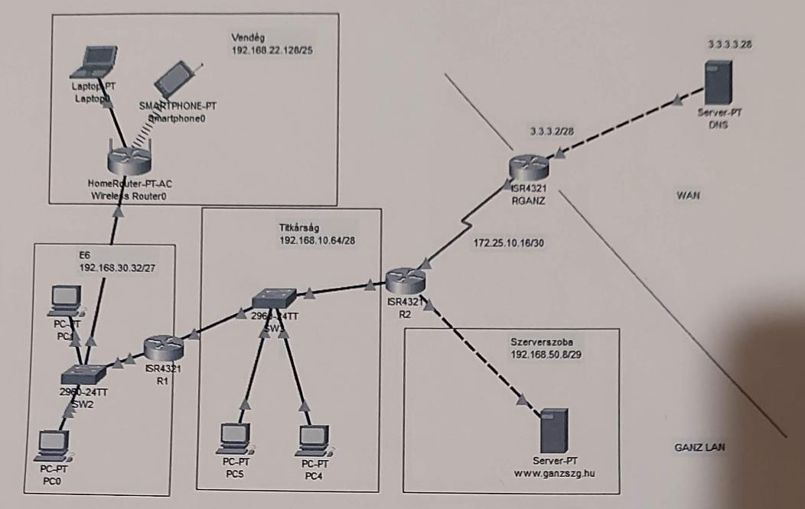
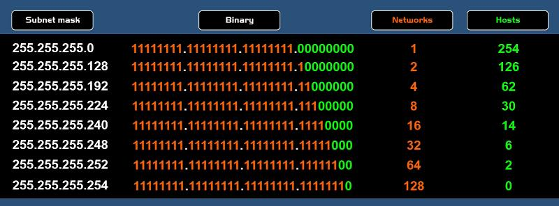
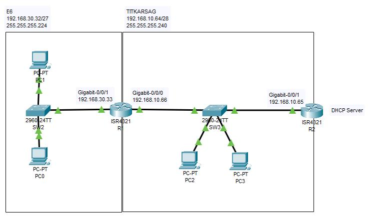
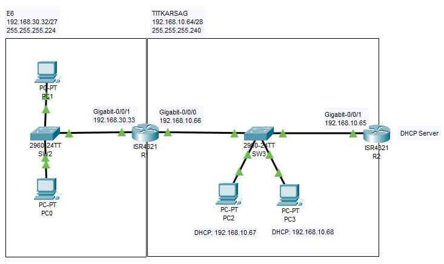
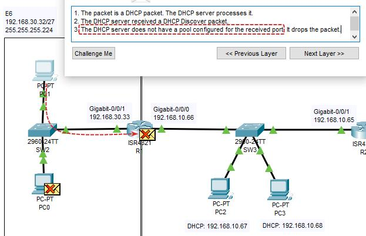
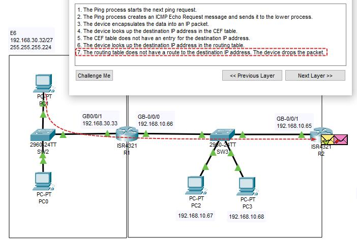
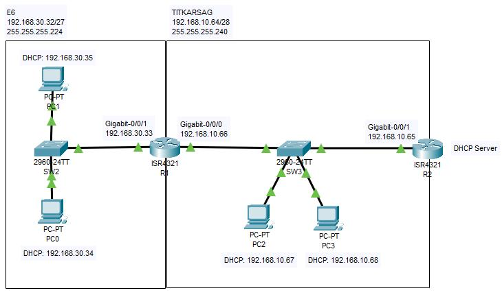

# Hálózatok - DHCP Routing

## Tananyag

[DHCP szolgáltatás beállítása](https://www.youtube.com/watch?v=q29_iMZaRDA&list=PLX7PhJYdwFyB78D4PSjt94Ign4UUTSbOC&index=4) by `Tanár Úr szertára`

## Feladatkiírás



## Statikus IP címek megadása

[Subnet Mask magyarázat](https://www.youtube.com/watch?v=s_Ntt6eTn94) by `PowerCert`



`TITKARSAG` hálózat:

- CIDR: `192.168.10.64/28`
- Network address: `192.168.10.64`
- Host Range: `192.168.10.65` - `192.168.10.78`
- Broadcast address: `192.168.10.79`

| Device    | Interface            | IPv4 Address    | Subnet Mask       |
| --------- | -------------------- | --------------- | ----------------- |
| R2 router | GigabitEthernet0/0/1 | `192.168.10.65` | `255.255.255.240` |
| R1 router | GigabitEthernet0/0/0 | `192.168.10.66` | `255.255.255.240` |

`E6` hálózat:

- CIDR: `192.168.30.32/27`
- Network address: `192.168.30.32`
- Host Range: `192.168.30.33` - `192.168.30.62`
- Broadcast address: `192.168.30.63`

| Device    | Interface            | IPv4 Address    | Subnet Mask       |
| --------- | -------------------- | --------------- | ----------------- |
| R1 router | GigabitEthernet0/0/1 | `192.168.30.33` | `255.255.255.224` |



## DCHP Pool létrehozása (`R2 router`)

`TITKARSAG` DHCP pool és excludes beállítása:

```cisco
ip dhcp excluded-address 192.168.10.65 192.168.10.66
ip dhcp pool TITKARSAG
  default-router 192.168.10.65
  network 192.168.10.64 255.255.255.240
```

`E6` DHCP pool és excludes beállítása:

```cisco
ip dhcp excluded-address 192.168.30.33
ip dhcp pool E6
  default-router 192.168.30.33
  network 192.168.30.32 255.255.255.224
```

`PC2` és `PC3` megkapja az IP címet:



## DHCP realy agent beállítás (`R1 router`)

R1 router megkapja a DHCP csomagot, de nincs pool configurálva, ezért eldobja az üzenetet:



DHCP realy agent hozzáadása R1 router-hez:

```cisco
interface GigabitEthernet 0/0/1
ip helper-address 192.168.10.65
```

Ezzel beállítottuk, hogy ha a `GigabitEthernet 0/0/1` interface-re UDP üzenet érkezik, akkor azt dobja tovább a `GigabitEthernet 0/0/0` interface irányába.

## Route hozzáadása (`R2 router`)

A DHCP csomag már eljut az R2 router-ig, de nem tudja hova kell válaszolni, mert nem ismeri a `192.168.30.32/27` hálózatot:



Az `ip route` parancs három paramétert vár:

- Network address: `192.168.30.32`
- Subnet Mask: `255.255.255.224`
- Milyen irányba küldje a csomagot, ha a `192.168.30.32/27` hálózatba kell küldeni valamit.  
  (Ilyenkor küldje `192.168.10.66`-ra és R1 majd tudja mit kell vele kezdeni.)

Route hozzáadása R2 router-hez:

```bash
ip route 192.168.30.32 255.255.255.224 192.168.10.66
# ... ez ugyanaz mintha a grafikus felületen a 'Config' fülön a 'Static' menüben hoznánk létre az útvonalat.
```

Most már `PC0` és `PC1` is megkapja az IP címet:


